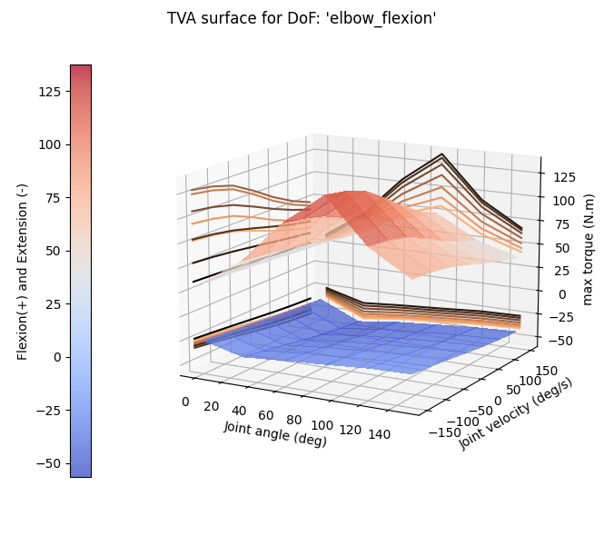

# simMACT

## Presentation (english version below)

*Une bibliothèque logicielle de calcul des couples d'actionnement articulaires humains maximaux pour l'aide à la conception de poste de travail ergonomiques.*

`simMACT` (simulation of Maximal ACtuation Torques) est un projet de bibliothèque logicielle issue des travaux de recherche menés par l'INRS et Inria-AUCTUS. Ces travaux concernent l'estimation des performances physiques humaines pour la conception d'équipements de travail. L'objectif de `simMACT` est d'améliorer les fonctionnalités de simulation des efforts articulaires d'un logiciel de mannequin numérique (Digital Human Model, DHM) en y associant, comme une boite noire, un modèle biomécanique avancé. `simMACT` a fait l'objet d'une [publication dans le journal **Journal of Biomech Engineering**](https://doi.org/10.1115/1.4064661).

`simMACT` repose sur deux éléments de base:
- un moteur de simulation musculo-squelettique, pour estimer les performances humaines dans des conditions aussi génériques que possible (réalisation d'une tâche dynamique);
- le formalisme mathématique des zonotopes, une classe particulière de polytopes, efficace pour modéliser l'actionnement d'un système rigide poly-articulé.

À ce jour, `simMACT` est au stade démonstrateur. Il utilise le moteur de simulation musculo-squelettique [**OpenSim**](https://opensim.stanford.edu/) à partir de sa version 4, mais d'autres outils pourraient être envisagés (AnyBody, BoB, etc.) à condition d'implémenter une interface logicielle adaptée. Les calculs de zonotopes et calculs annexes sont implémentés en langage Python (version 3.8 pour compatibilité avec **OpenSim** 4.+).

## Diffusion et licence
`simMACT` est diffusé sur ce site selon aux termes de la licence BSD-3 clauses.

## Organisation et exécution du code

### Arborescence
Le code et les données nécessaires au fonctionnement de `simMACT` sont organisés comme suit:
- le dossier `Models` contient le(s) modèle(s) musculosqulettique(s) permettant de simuler les performances humaines. Pour permettre le test de `simMACT`, le modèle `Arm26` fourni avec le logiciel **OpenSim** et une version adaptée du modèle `MoBL` issu des travaux de Saul *et al.* sont joints dans le repository. L'installation de `OpenSim` avec son API Python est laissée au soin des utilisateurs (il pourra être nécessaire d'installer également **simBody** pour visualiser le modèle musculosquelettique);
- le dossier `Python` contient les scripts d'interface avec **OpensSim** ainsi que les calculs de zonotope et autres calculs associés;
- le dossier `Resources` contient les illustrations et autres éléments permettant de comprendre le projet.

#### Code
Les scripts `MSM_Processor` et  `ZNT_Processor` constituent la base de `simMACT`. Ils peuvent être exécutés tels quels (pour comprendre leurs fonctionalités) ou inclus dans des scripts plus complexes (par exemple pour simuler une tâche expérimentale). Les figures 1 et 2 illustrent certaines fonctionalités de `MSM_Processor`.

Figure 1: 
Figure 2: 

Les figures 3 et 4 illustrent certaines fonctionalités de `ZNT_Processor`.

Figure 3: 
Figure 4: 

D'autres scripts sont inclus dans ce repository: ils ont servi à des travaux de recherche en vue de la qualification de la fiabilité de `simMACT` (par exemple , https://esbiomech.org/conference/archive/2023maastricht/195.pdf, https://inria.hal.science/hal-04140099/document). Ces scripts sont pour l'instant à l'état de "documents de travail".

Les figures 5 et 6 obtenues à l'aide du script `ACT_Analyzer.py` présentent un exemple de code pour le calcul de la caractéristique *Torque-Angle-Velocity* de flexion-extension du coude à l'aide du modèle `MoBL`.

Figure 5: 
Figure 6: 

#### Documentation
Le code est largement expliqué à l'aide de `docstrings` réparties dans les sources. Ces `docstrings` peuvent être exploitées par l'outil `Sphinx`, mais la génération automatique de cette documentation n'est pas encore implémentée.

## Roadmap
Les actions suivantes sont envisagées à court, moyen ou long terme:
- mise en place de tests (unitaires, intégration) et de la documentation automatique;
- personnalisation du modèle musculosqulettique (géométrie et cinématique, paramétrage des muscles);
- prise en compte des effets dynamiques (déduire la gravité et les accélérations des capacités de couples);
- développement d’un calculateur *en ligne* (site web) pour éviter à l'utilisateur non expert d'avoir à installer **OpenSim**, **SimBody**, Python, etc.;
- prise en compte de critères de stabilité articulaire (par exemple, que l’épaule ne se "déboite pas");
- etc.

# simMACT
*A software library to compute human joint actuation torques for ergonomics purpose*.

`simMACT` (simulation of Maximal ACtuation Torques) is a software library resulting from research carried out by INRS and Inria-AUCTUS. This work concerns the estimation of human physical performance for the design of work equipment. The aim of `simMACT` is to improve some simulation features of a digital mannequin software (Digital Human Model, DHM), namely the computation of joint actuation torques. It relies on an advanced biomechanical model. This work was the subject of a [publication in the **Journal of Biomech Engineering**](https://doi.org/10.1115/1.4064661).

`simMACT` is based on two fundamental parts:
- a musculoskeletal simulation engine, to estimate human performance under the most generic conditions possible (performance of a dynamic task);
- the mathematical formalism of zonotopes, a particular class of polytopes, efficient for modeling the actuation of a rigid polyarticulated system.

To date, `simMACT` is in the demonstrator stage. It relies on the musculoskeletal simulation engine [**OpenSim**](https://opensim.stanford.edu/) from version 4.0. Other tools could be considered as well (such as AnyBody, BoB, etc.), provided a suitable software interface is available. Zonotope and related calculations are implemented in Python (version 3.8 for compatibility with **OpenSim** 4.+).

## Distribution and license
`simMACT` is available from this site under the terms of the BSD-3 clauses license.

## Code organization and execution

### Folder structure
The code and data required to run `simMACT` are organized as follows:
- the `Models` folder contains the musculoskeletal model(s) used to simulate human performance. For the sake of testing `simMACT`, the `Arm26` model supplied with the **OpenSim** software and an adapted version of the `MoBL` model from the work of Saul *et al.* are included into the repository. Users are to install `OpenSim` with its Python API. They may also need to install **simBody** to view the musculoskeletal model;
- the `Python` folder contains scripts for interfacing with **OpensSim**, as well as zonotope and related calculations;
- the `Resources` folder contains illustrations and other elements to help understand the project.

### Code
The `MSM_Processor` and `ZNT_Processor` scripts form the basis of `simMACT`. They can be run as is (to understand their functionality) or included in more complex scripts (to simulate an experimental task, for example). Figures 1 and 2 illustrate some of the features of `MSM_Processor`.

Figure 1: 
Figure 2: 

Figures 3 and 4 illustrate some of the features of `MSM_Processor`.

Figure 3: 
Figure 4: 

Other scripts are included in this repository: they have been used for research into the reliability of `simMACT` (for instance, https://esbiomech.org/conference/archive/2023maastricht/195.pdf, https://inria.hal.science/hal-04140099/document). These scripts are currently only at the "work in progress" stage.

Figures 5 and 6, obtained using the `ACT_Analyzer.py` script, show sample code for calculating the *Torque-Angle-Velocity* bending-extension characteristic of the elbow using the `MoBL` model.

Figure 5: 
Figure 6: 

#### Documentation
The code is largely explained using `docstrings` distributed throughout the source code. These `docstrings` can be processed by the `Sphinx` tool, but automatic generation of this documentation has not yet been implemented.

## Roadmap
The following actions are planned for the short, medium and long term:
- implementation of tests (unit tests, integration tests) and automatic documentation;
- customization of the musculoskeletal model (geometry and kinematics, muscle parameterization);
- taking dynamic effects into account (deducing gravity and accelerations from torque capacities);
- development of an “on-line” calculator (website) to save the non-expert user having to install **OpenSim**, **SimBody**, Python, etc;
- inclusion of joint stability criteria (e.g. that the shoulder does not “dislocate”);
- etc.